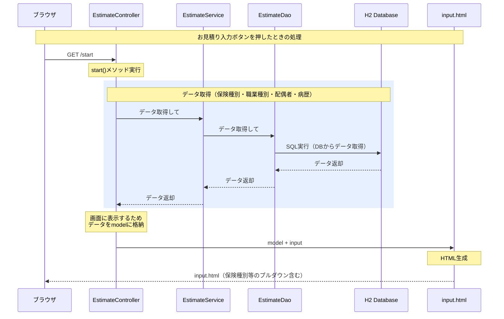

# TISCON

## ディレクトリ構造

| ディレクトリ        | 説明                                                       |
|---------------------|------------------------------------------------------------|
| src/main/java       | Javaソースコード置き場                                     |
| src/main/resources/ | リソース置き場（設定ファイル、HTMLテンプレート、画像など） |
| docs/               | ドキュメント置き場                                         |
| README.md           | 説明書き                                                   |

### ソースディレクトリ(src/main/java)

`src/main/java`配下にある各パッケージの説明を以下に示す。

| パッケージ            | 説明                                                                                 |
|-----------------------|--------------------------------------------------------------------------------------|
| com.tiscon.controller | リクエストを受け付けるコントローラクラス                                             |
| com.tiscon.form       | 画面からの入力値を保持するフォームクラス                                             |
| com.tiscon.service    | UIに依存しない業務処理を担当するサービスクラス。コントローラから呼ばれる。           |
| com.tiscon.dao        | データベースアクセスを行うクラス。Data Access Objectの略。                           |
| com.tiscon.dto        | コントローラ-サービス間の値受け渡しに使用するDTOクラス。Data Transfer Objectの略。   |
| com.tiscon.domain     | データベースのテーブルと対応するクラス。DBの1レコードがJavaの1インスタンスに対応する。 |

### リソースディレクトリ(src/main/resources)

`src/main/resources`配下の各ディレクトリの説明を以下に示す。

| ディレクトリ | 説明                                                                 |
|--------------|----------------------------------------------------------------------|
| data         | データベースに初期投入されるデータ                                   |
| static/css   | CSSファイル                                                          |
| static/img   | 画像ファイル                                                         |
| static/js    | JavaScriptファイル                                                   |
| templates    | HTMLテンプレート。画面表示を変更する場合はここのファイルを修正する。 |

## 使用技術

| 名前        | 説明                                               |
|-------------|----------------------------------------------------|
| Java        | プログラミング言語                                 |
| Spring Boot | Java用アプリケーションフレームワーク               |
| Thymeleaf  | テンプレートエンジン。HTMLを描画するのに使用する。 |

### Spring Boot

Webアプリケーションの構築に`Spring Web MVC`を、データベースアクセスに`Spring JdbcTemplate`を使用している。

## アプリの流れ
アプリケーションの理解を助けるため、一部の処理の流れを以下に記載する。

## その他

- データベース
    - [H2 Databaseに登録したデータを確認する](docs/h2Database.md)
